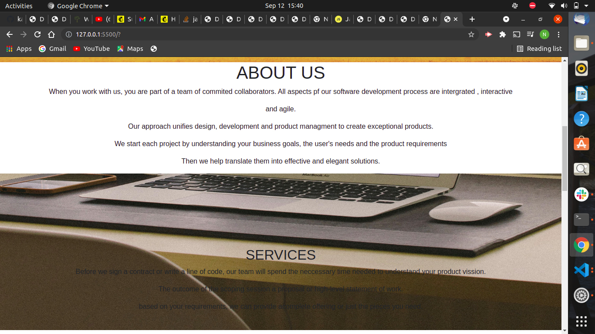
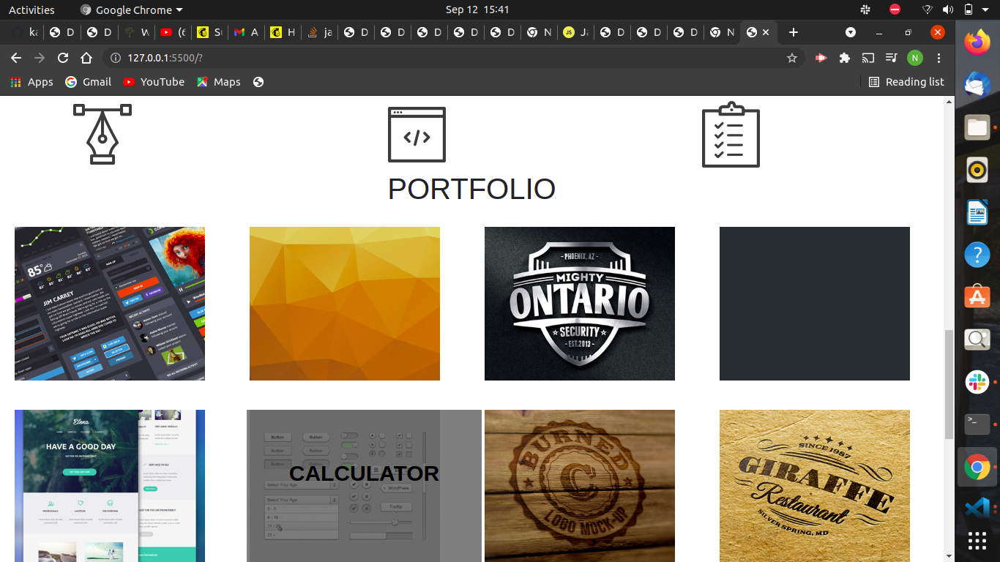
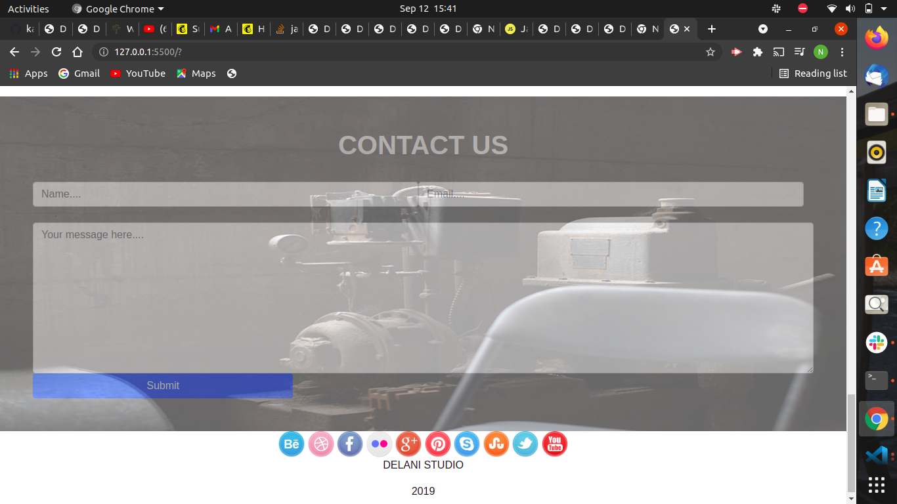

# week 3 project
 moringa school
## APPLICATION NAME.
DELANI STUDIO
 ## application description
This is delani studio website which provide the services they provide,their address  and how to reach them out.
 
  
 
  

## NAMES OF AUTHOR
*1.Nur Nure Tusa*

# Setup/Installation Requirements

1. Clone the project using git -clone . If you are not able to clone it, you can download the files as a zip folder

2. Ensure that you have the complete file

3. Navigate to the index.html file which is in the root file of the folder. The application is static and only uses HTML and CSS 

4. Copy the path of the index.html file to your browser and you will be able to access the application.

# description of the project purpose
This is a project that shows delanio studio

# live link of the website

## BUilt with
*1.html*

*2.css*

*3. java script*

*4. bootstrap*

*5.jquery*

## support team for more information .
*NAME - nur tusa*.
*EMAIL - nur.tusa@student.moringaschool.com*.
*CONTACT - +254115314390*. 
*ADDRESS - NAIROBI KENYA *.

#### licence information with a copyright & date

2021 Copyright All Rights Reserved To tusa company

